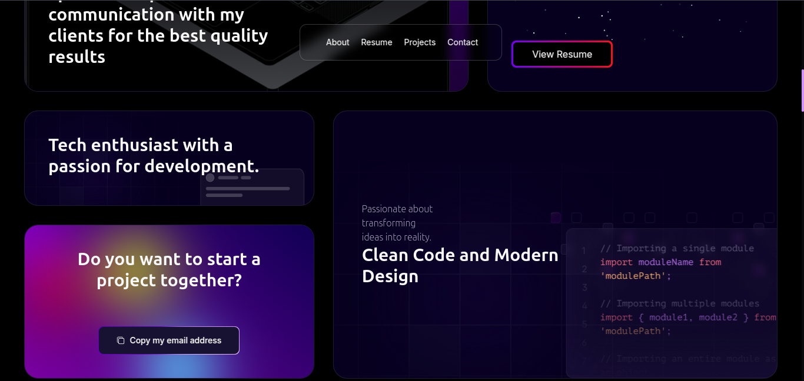

<p align="center">
  
</p>

#  Sameer’s Developer Portfolio

Welcome to my interactive portfolio! Built with Next.js, Three.js, Framer Motion, and Tailwind CSS, this project showcases my skills, projects, and experience in a visually engaging and modern way.


## 🌐 Demo

**Live Site:** [https://your-portfolio-link.com](https://portfolio-coral-two-16.vercel.app/)
---

## 📋 Table of Contents

1. [Introduction](#introduction)
2. [Demo](#demo)
3. [Tech Stack](#tech-stack)
4. [Features](#features)
5. [Screenshots](#screenshots)
6. [Recent Projects](#recent-projects)
7. [Work Experience](#work-experience)
8. [Getting Started](#getting-started)
9. [Folder Structure](#folder-structure)
10. [Contribution](#contribution)
11. [License](#license)
12. [Contact & Socials](#contact--socials)

---

## 🤖 Introduction

This portfolio is designed to highlight my technical expertise, creative approach, and professional journey. It features:

- Interactive 3D elements
- Modern UI/UX
- Responsive design
- Real project showcases


---

## ⚙️ Tech Stack

- **Framework:** Next.js
- **3D & Animation:** Three.js, Framer Motion
- **Styling:** Tailwind CSS
- **Other:** TypeScript, React Icons

---

## 🔋 Features

- **Hero Section:** Spotlight effect, dynamic backgrounds
- **Bento Grid:** Modern, responsive layout for personal info
- **3D Elements:** Interactive globe, card hover effects
- **Testimonials:** Animated, dynamic testimonials
- **Work Experience:** Timeline and highlights
- **Canvas Effects:** Custom HTML5 canvas visuals
- **Recent Projects:** Showcases with live links and tech icons
- **Fully Responsive:** Mobile-first, works on all devices
- **Reusable Components:** Modular, clean codebase


## 💼 Work Experience

- **React Library:** Developed `react-infinite-scroller` for horizontal logo animations (in progress)
- **Freelance Project:** Delivered custom web solutions for clients
- **AR Web App:** Built AR-based web app for client machine presentations (NDA signed)

---

##  Getting Started

### Prerequisites

- [Git](https://github.com/sameer2210)
- [Node.js](https://nodejs.org/en)
- [npm](https://www.npmjs.com/) (or yarn/pnpm/bun)

### Installation

```bash
git clone https://github.com/sameer2210/Portfolio.git
cd Portfolio
npm install
```

### Running Locally

```bash
npm run dev
# or

# or
pnpm dev
# or
bun dev
```

Visit [http://localhost:3000](http://localhost:3000) in your browser.

---

## 📁 Folder Structure

```
Portfolio/
├── app/           # Next.js app directory (pages, layout, providers)
├── components/    # Reusable React components (UI, sections)
├── data/          # Static data (projects, testimonials, etc.)
├── lib/           # Utility functions
├── public/        # Static assets (images, svgs)
├── styles/        # Global styles (if any)
├── ...            # Config and setup files
```

---

## 🤝 Contribution

Contributions, issues, and feature requests are welcome! Feel free to fork the repo and submit a pull request.

---

## 📄 License

This project is open source and available under the [MIT License](LICENSE).

---

## 📬 Contact & Socials

- **GitHub:** [sameer2210](https://github.com/sameer2210)
- **Twitter (X):** [@Sameer2210\_](https://x.com/Sameer2210_)
- **LinkedIn:** [LinkedIn](https://www.linkedin.com/in/sameer-khan2210/)
- **Email:** sameerkhan@gmail.com

---

> _Thank you for visiting my portfolio!_
